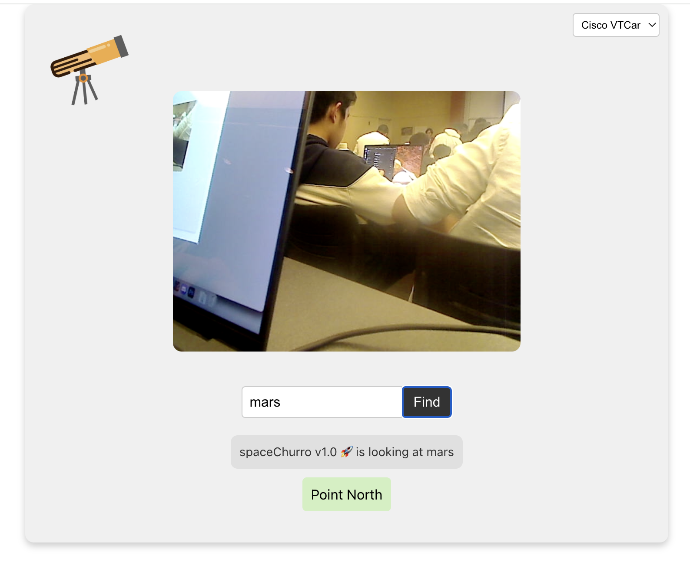

# Space Churro

**Space Churro** is an innovative smart lens device that can locate and point to celestial objects in the night sky, making stargazing and astronomy exploration easy and accessible for anyone. With a web-based interface, Space Churro allows users to simply input the name of a star, planet, or constellation, and the device will accurately point to its position in the sky. It’s a perfect companion for astronomy enthusiasts, students, and curious minds alike!

## Tech Stack

- **Frontend**: React.js
- **Backend**: Flask
- **Hardware**: Raspberry Pi, smart lens, and GPIO Zero for robotic arm control
- **API**: Skyfield API for celestial data
- **Programming Languages**: Python (for robotic arm control and backend), JavaScript (for frontend)

